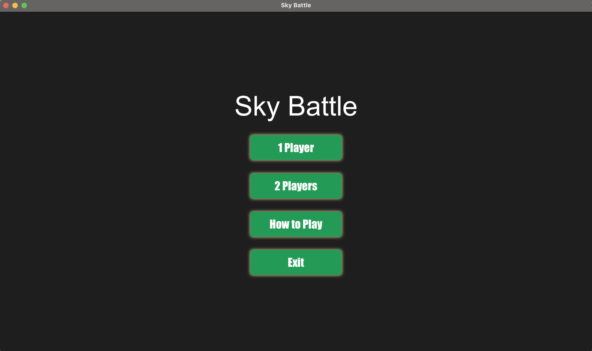
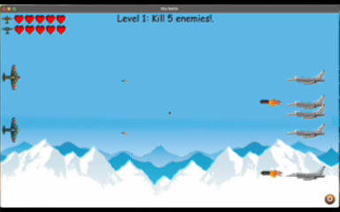
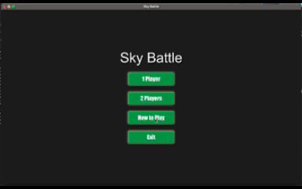
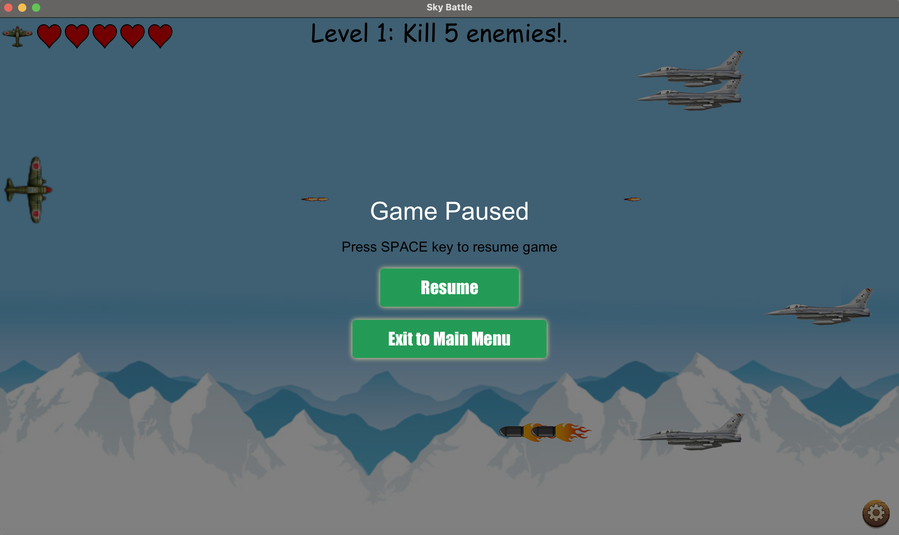
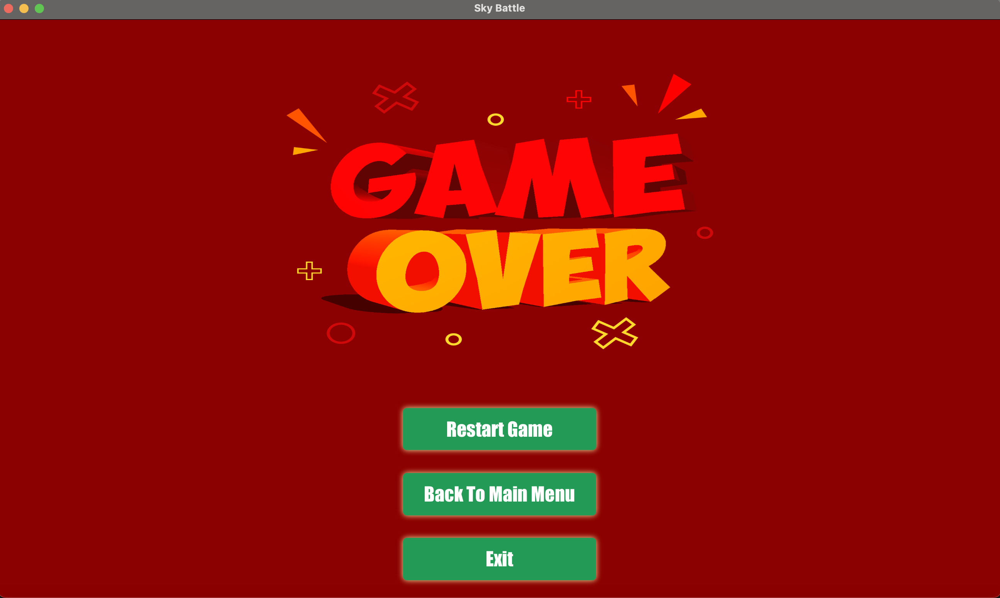
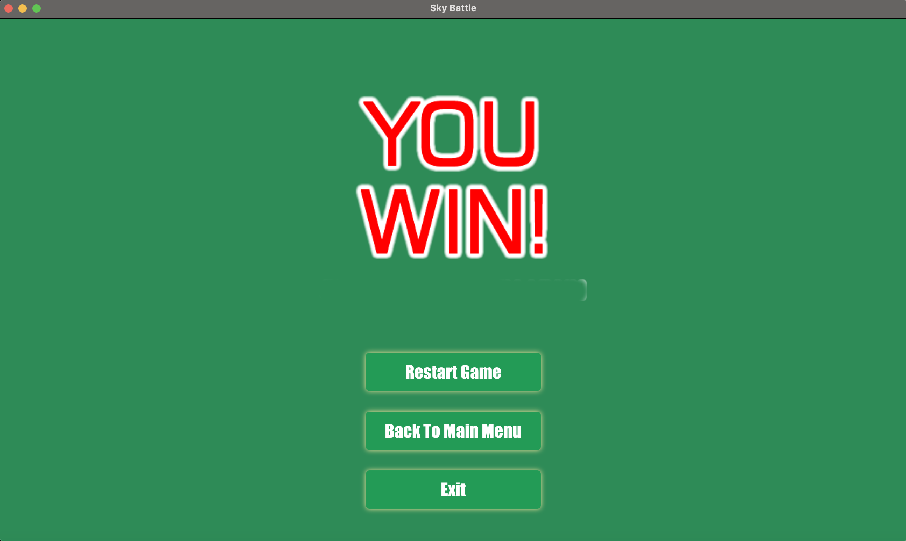
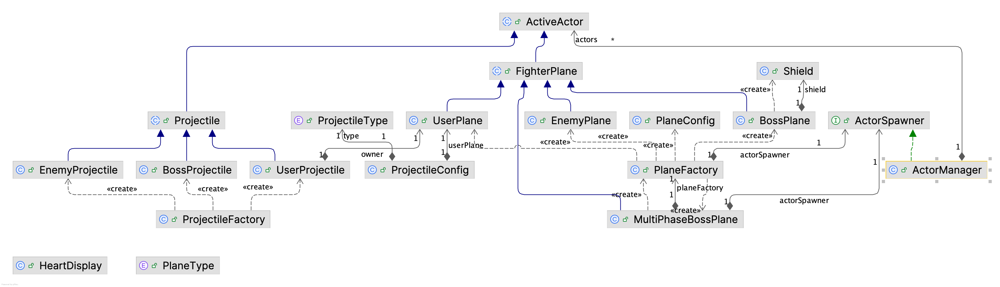

# Table of Contents

- [Github Repository](#github-repository)
- [Introduction](#introduction)
    - [Project Goals](#project-goals)
    - [Project Structure](#project-structure)
- [Compilation Instructions](#compilation-instructions)
- [Implemented and Working Properly](#implemented-and-working-properly)
    - [Frontend](#frontend)
    - [Backend](#backend)
- [Implemented but Not Working Properly](#implemented-but-not-working-properly)
- [Features Not Implemented](#features-not-implemented)
- [New Java Classes](#new-java-classes)
- [Modified Java Classes](#modified-java-classes)
- [Deleted Java Classes](#deleted-java-classes)
- [Unexpected Problems](#unexpected-problems)

# Github Repository
https://github.com/swyannnn/CW2024

# Introduction
Welcome to my Developing Maintenance Software coursework project. I am Seow Weng Yann (Student ID: 20618809), and this project focuses on creating an implementation of the classic game **1942**.

For the best experience, it is recommended to view this `README.md` file on the [GitHub website](https://github.com/swyannnn/CW2024). Navigation links have been embedded throughout the document to facilitate easy access to different sections.

## Project Goals

- **User-Friendly Design:** Develop an intuitive and hassle-free gaming experience that is easy to understand and enjoyable to play.
- **Enhanced User Experience:** Focus on improving the overall user interaction and engagement with the game.
- **Maintainable Codebase:** Refactor the existing code to ensure it is clean, well-organized, and prepared for future expansions and enhancements.

## Project Structure 

```
📦demo
 ┣ 📂actor
 ┃ ┣ 📂plane
 ┃ ┃ ┣ 📂component
 ┃ ┃ ┃ ┣ 📜HeartDisplay.java
 ┃ ┃ ┃ ┗ 📜Shield.java
 ┃ ┃ ┣ 📜BossPlane.java
 ┃ ┃ ┣ 📜EnemyPlane.java
 ┃ ┃ ┣ 📜FighterPlane.java
 ┃ ┃ ┣ 📜MultiPhaseBossPlane.java
 ┃ ┃ ┣ 📜PlaneConfig.java
 ┃ ┃ ┣ 📜PlaneFactory.java
 ┃ ┃ ┣ 📜PlaneType.java
 ┃ ┃ ┗ 📜UserPlane.java
 ┃ ┣ 📂projectile
 ┃ ┃ ┣ 📜BossProjectile.java
 ┃ ┃ ┣ 📜EnemyProjectile.java
 ┃ ┃ ┣ 📜Projectile.java
 ┃ ┃ ┣ 📜ProjectileConfig.java
 ┃ ┃ ┣ 📜ProjectileFactory.java
 ┃ ┃ ┣ 📜ProjectileType.java
 ┃ ┃ ┗ 📜UserProjectile.java
 ┃ ┣ 📜ActiveActor.java
 ┃ ┗ 📜ActorSpawner.java
 ┣ 📂effect
 ┃ ┣ 📜ExplosionEffect.java
 ┃ ┗ 📜FlickerEffect.java
 ┣ 📂handler
 ┃ ┣ 📜CollisionHandler.java
 ┃ ┣ 📜GameLoopHandler.java
 ┃ ┣ 📜HealthChangeHandler.java
 ┃ ┗ 📜InputHandler.java
 ┣ 📂level
 ┃ ┣ 📜.DS_Store
 ┃ ┣ 📜Level001.java
 ┃ ┣ 📜Level002.java
 ┃ ┣ 📜Level003.java
 ┃ ┣ 📜Level004.java
 ┃ ┣ 📜LevelConfig.java
 ┃ ┣ 📜LevelFactory.java
 ┃ ┗ 📜LevelParent.java
 ┣ 📂manager
 ┃ ┣ 📜.DS_Store
 ┃ ┣ 📜ActorManager.java
 ┃ ┣ 📜AudioManager.java
 ┃ ┣ 📜ButtonManager.java
 ┃ ┣ 📜CollisionManager.java
 ┃ ┣ 📜GameLoopManager.java
 ┃ ┣ 📜ImageManager.java
 ┃ ┣ 📜InputManager.java
 ┃ ┗ 📜StateManager.java
 ┣ 📂screen
 ┃ ┣ 📜LevelScreen.java
 ┃ ┣ 📜LoseScreen.java
 ┃ ┣ 📜MainMenuScreen.java
 ┃ ┣ 📜PauseScreen.java
 ┃ ┗ 📜WinScreen.java
 ┣ 📂state
 ┃ ┣ 📜GameState.java
 ┃ ┣ 📜LevelState.java
 ┃ ┣ 📜LoseState.java
 ┃ ┣ 📜MainMenuState.java
 ┃ ┣ 📜StateFactory.java
 ┃ ┣ 📜StateTransitioner.java
 ┃ ┗ 📜WinState.java
 ┣ 📂strategy
 ┃ ┣ 📂firing
 ┃ ┃ ┣ 📜BossFiringStrategy.java
 ┃ ┃ ┣ 📜EnemyFiringStrategy.java
 ┃ ┃ ┣ 📜FiringStrategy.java
 ┃ ┃ ┣ 📜MultiPhaseBossFiringStrategy.java
 ┃ ┃ ┗ 📜UserFiringStrategy.java
 ┃ ┗ 📂movement
 ┃ ┃ ┣ 📜BossMovementStrategy.java
 ┃ ┃ ┣ 📜EnemyMovementStrategy.java
 ┃ ┃ ┣ 📜MovementStrategy.java
 ┃ ┃ ┣ 📜MovementType.java
 ┃ ┃ ┣ 📜MultiPhaseBossMovementStrategy.java
 ┃ ┃ ┗ 📜UserMovementStrategy.java
 ┣ 📂util
 ┃ ┣ 📜GameConstant.java
 ┃ ┗ 📜PlayerKeyBindings.java
 ┣ 📜Controller.java
 ┗ 📜Main.java
```

# Compilation Instructions
## Prerequisites
**1. JDK 21**
<li>Ensure Java Development Kit (JDK) 21 is installed.</li>
<li>Set <code>JAVA_HOME</code> to the JDK 21 installation path.</li><br>

Verify installation:
```
java --version
```

**2. IntelliJ IDEA**

Download and install IntelliJ IDEA from [jetbrains.com/idea](https://www.jetbrains.com/idea/download/?section=windows).

**3. Git**

Ensure Git is installed and configured.

Verify installation:
```
git --version
```

## Steps to Compile and Run the Project
**1. Clone the Repository**
```
git clone https://github.com/swyannnn/CW2024.git
cd CW2024
```

**2. Open the Project in IntelliJ IDEA**

<li>Launch IntelliJ IDEA.</li>
<li>Click <code>File > Open</code> and select the <code>pom.xml</code> file in the cloned project folder.</li>
<li>IntelliJ will automatically import dependencies and configure the project.</li><br>

**3. Set the JDK Version**
<li>Go to <code>File > Project Structure > Project</code>.</li>
<li>Set the Project SDK to <code>JDK 21</code>.</li>
<li>Ensure the Language Level is set to <code>21 - (Preview)</code> if required.</li><br>

**4. Build the Project**
<li>Open the Maven tool window (on the right side).</li>
<li>Run the following lifecycle phases in order:
  <ul>
    <li><code>clean</code></li>
    <li><code>install</code></li>
  </ul>
</li>


**5. Run the Application**
<li>Right-click the file and select Run <code>Main.java</code> located at <code>src/main/java/com/example/demo</code></li><br>

# Implemented and Working Properly
This section details the features that have been successfully implemented in both the frontend and backend of the project. Each feature is explained by outlining the <b>original version</b>, the <b>shortcomings of that approach</b>, <b>reasons why the modifications enhance the overall project</b> and the <b>new implementation</b>.

## Frontend
### **1. Main Menu**
<table style="width:100%">
  <tr>
    <th>Original Version</th>
    <th>Reason for Improvement/Modification</th>
    <th>New Implementation</th>
  </tr>
  <tr>
    <td>
    Main menu page doesn't exist
    </td>
    <td>
    No centralized hub for accessing different game functionalities, leading to a disorganized entry point.
    </td>
    <td>
    A comprehensive main menu has been developed, offering players options to start the game or select other functionalities.
      <div align="center">
        
      </div>
    </td>
  </tr>
</table>

### **2. Double Player Option**
<table style="width:100%">
  <tr>
    <th>Original Version</th>
    <th>Reason for Improvement</th>
    <th>New Implementation</th>
  </tr>
  <tr>
    <td>
    Only single-player mode
    </td>
    <td>
    <li>Limiting the game to single player mode restricted the potential audience and replayability.</li>
    <li>Catering to different player preferences accommodates both solo and group gaming sessions.</li>
    </td>
    <td>
    Players can now choose between single player or double player modes before starting the game.
      <div align="center">
        
      </div>
    </td>
  </tr>
</table>

### **3. Game Instruction**
<table style="width:100%">
  <tr>
    <th>Original Version</th>
    <th>Reason for Improvement</th>
    <th>New Implementation</th>
  </tr>
  <tr>
    <td>
    No instructions provided
    </td>
    <td>
    <li>Players are unaware of game objectives and controls, leading to a confusion and frustration.</li>
    <li>Offering clear instructions ensures they know what to expect when gameplay begins.</li>
    </td>
    <td>
    Instructions are now easily visible on game screen.
      <div align="center">
        
      </div>
    </td>
  </tr>
</table>

### **4. Scrolling Backgrounds**
<table style="width:100%">
  <tr>
    <th>Original Version</th>
    <th>Reason for Improvement</th>
    <th>New Implementation</th>
  </tr>
  <tr>
    <td>
    Static backgrounds
    </td>
    <td>
    <li>Static backgrounds can make the game feel monotonous and less immersive. </li>
    <li>Improving visual appeal and immersion is necessary to keep players engaged and provides a more lively gaming environment.</li>
    </td>
    <td>
    A visually appealing scrolling background has been implemented.
    </td>
  </tr>
</table>

### **5. Automated Fire Projectile without Key Press**
<table style="width:100%">
  <tr>
    <th>Original Version</th>
    <th>Reason for Improvement</th>
    <th>New Implementation</th>
  </tr>
  <tr>
    <td>
    Players are required to press the spacebar to fire projectiles
    </td>
    <td>
    <li>Requiring repetitive key presses could be cumbersome during intense gameplay. </li>
    <li>Reducing the need for repetitive key presses allows players to focus more on movement and strategy rather than repeatedly pressing a key.</li>
    </td>
    <td> 
    The fire mechanism has been automated to ensure continuous firing without extra input.
    </td>
  </tr>
</table>

### **6. Player(s) Horizontal Movement**
<table style="width:100%">
  <tr>
    <th>Original Version</th>
    <th>Reason for Improvement</th>
    <th>New Implementation</th>
  </tr>
  <tr>
    <td>
    Players are only allowed to move vertically
    </td>
    <td> 
    <li>Restricting movement to one axis limits gameplay complexity and player control.</li>
    <li>Ensuring responsive controls enhances gameplay fluidity and player satisfaction by providing seamless interaction with the game environment.</li>
    </td>
    <td>
    The player characters can now move smoothly and intuitively along the horizontal axis.
    </td>
  </tr>
</table>


### **7. Pause Option**
<table style="width:100%">
  <tr>
    <th>Original Version</th>
    <th>Reason for Improvement</th>
    <th>New Implementation</th>
  </tr>
  <tr>
    <td>
    Pausing option doesn't exist
    </td>
    <td>
    <li>Inability to pause can disrupt the gaming experience, especially during unforeseen interruptions. </li>
    <li>Allowing players to pause the game allow players with more control over their gaming experience and the flexibility.</li>
    </td>
    <td>
    The game can now be paused at any time during play using a keyboard shortcut or by clicking on the settings icon, then resume gameplay at their own pace.
      <div align="center">
        
      </div>
    </td>
  </tr>
</table>

### **9. Audio Integration**
<table style="width:100%">
  <tr>
    <th>Original Version</th>
    <th>Reason for Improvement</th>
    <th>New Implementation</th>
  </tr>
  <tr>
    <td>
    Lack of audio and sound effects.
    </td>
    <td> 
    <li>Absence of audio fail to provide essential feedback to player actions.</li>
    <li>Incorporating audio makes the gameplay more engaging and enjoyable for players.</li>
    </td>
    <td>
    <li>Audio elements, such as background music, sound effects, and in-game notifications have been successfully integrated.</li>
    <li>All the logics are handled by <a href="src/main/java/com/example/demo/manager/AudioManager.java">AudioManager</a>.</li>
    </td>
  </tr>
</table>

### **10.Visual Effects**
<table style="width:100%">
  <tr>
    <th>Original Version</th>
    <th>Reason for Improvement</th>
    <th>New Implementation</th>
  </tr>
  <tr>
    <td>
    Poor visual feedback with minimal effects.
    </td>
    <td>
    <li>Lack of visual effects can make the game feel unresponsive and less exciting.</li>
    <li>Enhancing visual feedback and effects provides satisfying visual cues that enrich the player's experience.</li>
    </td>
    <td>
    Visual effects, including explosions, player actions, and enemy interactions, have been implemented.
      <div align="center">
        
      </div>
      <div align="center">
        
      </div>
    </td>
  </tr>
</table>

### **11. Creation of Playable Levels**
<table style="width:100%">
  <tr>
    <th>Original Version</th>
    <th>Reason for Improvement</th>
    <th>New Implementation</th>
  </tr>
  <tr>
    <td>
    Only two playable levels are featured<
    </td>
    <td>
    <li>Limited levels reduce the game's replayability and can lead to player boredom.</li>
    <li>Offering diverse and progressively challenging levels provides a continuous sense of progression and achievement for players.</li>
    </td>
    <td>
    <li>Two additional playable levels have been created</li>
    <li>Each with increasing difficulty, distinct environments, and unique challenges.</li>
    </td>
  </tr>
</table>

### **12. Game Over Screen**
<table style="width:100%">
  <tr>
    <th>Original Version</th>
    <th>Reason for Improvement</th>
    <th>New Implementation</th>
  </tr>
  <tr>
    <td>
    A game over icon is displayed upon losing but did not offer options to restart or return to the main menu.
    </td>
    <td>
    <li>Without options to retry or navigate away, players have limited control after failing, which can lead to frustration.</li>
    <li>Providing actionable options helps players understand their progress and decide on their next steps.</li>
    </td>
    <td>
    A Game Over screen has been developed to inform players when they have failed a level. 
      <div align="center">
        
      </div>
    </td>
  </tr>
</table>

### **13. Win Screen**
<table style="width:100%">
  <tr>
    <th>Original Version</th>
    <th>Reason for Improvement</th>
    <th>New Implementation</th>
  </tr>
  <tr>
    <td>
    A win icon is displayed upon losing but did not offer options to restart or return to the main menu.
    </td>
    <td>      
    <li>Without options to continue, players may feel the game ends abruptly without clear next steps. </li>
    <li>Celebrating player achievements reinforces positive gameplay experiences and motivates continued engagement with the game.</li>
    </td>
    <td>
    A Win screen has been developed to inform players when they have won the game.  
      <div align="center">
        
      </div>
    </td>
  </tr>
</table>

## Backend

### **1. Improved Animation Handling**
<table style="width:100%">
  <tr>
    <th>Original Version</th>
    <th>Reason for Improvement</th>
    <th>New Implementation</th>
  </tr>
  <tr>
    <td>
    UI updates were managed using <code>Timeline</code>, where keyframes were scheduled at fixed intervals.
    </td>
    <td>      
    <li>Fixed intervals can lead to frame drops or uneven animation timing, especially in fast-paced games.</li>
    <li>A more dynamic approach is needed to ensure smoother updates, regardless of the system's frame rate.</li>
    </td>
    <td>
    Switched to <code>AnimationTimer</code>, which provides a continuous game loop that updates based on system time. All these logics are handled by <a href="src/main/java/com/example/demo/manager/GameLoopManager.java">GameLoopManager</a>
    </td>
  </tr>
</table>

### **2. Remove Out-of-Bound Actors**
<table style="width:100%">
  <tr>
    <th>Original Version</th>
    <th>Reason for Improvement</th>
    <th>New Implementation</th>
  </tr>
  <tr>
    <td>
      Actors such as projectiles or enemies continued to exist even after moving off-screen.
    </td>
    <td>      
    <li>Allowing out-of-bound actors to persist unnecessarily increases memory usage and computational overhead.</li>
    <li>Removing them improves game performance and ensures efficient resource utilization. </li>
    <li> It also prevents potential logic errors involving out-of-bound actors.</li>
    </td>
    <td>
    Introduced logic to remove actors once they move outside the visible screen area.
    </td>
  </tr>
</table>

### **3. Reduce actor bounding box for less sensitive collision detection**
<table style="width:100%">
  <tr>
    <th>Original Version</th>
    <th>Reason for Improvement</th>
    <th>New Implementation</th>
  </tr>
  <tr>
    <td>
      Collision detection used the full bounding box of actors, which often resulted in overly sensitive collision responses.
    </td>
    <td>      
      <li>Using the full bounding box for collision detection does not account for the actual shape or movement of actors, leading to false-positive collisions.</li>
      <li>Reducing the bounding box size allows for more accurate and fair collision detection.</li>
    </td>
    <td>
      Reduced the collision bounding box size by applying a shrink factor to actor dimensions.
    </td>
  </tr>
</table>

### **4. Centralized State Management**
<table style="width:100%">
  <tr>
    <th>Original Version</th>
    <th>Reason for Improvement</th>
    <th>New Implementation</th>
  </tr>
  <tr>
    <td>
      Each level (e.g., LevelOne, LevelTwo) independently managed its logic, including level transitions, enemy spawning, and UI initialization. 
    </td>
    <td>      
      <li>Duplicated logic across levels made it challenging to scale or modify game behavior consistently.</li>
      <li>A centralized system simplifies transitions, improves code reusability, and enables scalable design.</li>
    </td>
    <td>
      A `StateManager` class was introduced, leveraging the <strong>State Pattern</strong> to centralize transitions and lifecycle management. More information please kindly visit <a href="#comexampledemostate">this section</a>.
    </td>
  </tr>
</table>

### **5. Improved Actor and Level Creation with Factory Pattern**
<table style="width:100%">
  <tr>
    <th>Original Version</th>
    <th>Reason for Improvement</th>
    <th>New Implementation</th>
  </tr>
  <tr>
    <td>
      Actors and levels were created manually in each class with hardcoded configurations.
    </td>
    <td>
      <li>Hardcoding actor and level creation increased redundancy and reduced scalability.</li>
      <li>Introducing a centralized factory allows dynamic creation of actors and levels with consistent configurations, enabling easy customization and future extensibility.</li>
    </td>
    <td>
      <li>Leveraged the <strong>Factory Pattern</strong> to create actors and levels dynamically. </li>
      <li>See <a href="src/main/java/com/example/demo/actor/plane/PlaneFactory.java">PlaneFactory</a>, <a href="src/main/java/com/example/demo/actor/projectile/ProjectileFactory.java">ProjectileFactory</a> and <a href="src/main/java/com/example/demo/level/LevelFactory.java">LevelFactory</a> for more details.</li>
    </td>
  </tr>
</table>

### **6. Flexible Behavior Management with Strategy Pattern**
<table style="width:100%">
  <tr>
    <th>Original Version</th>
    <th>Reason for Improvement</th>
    <th>New Implementation</th>
  </tr>
  <tr>
    <td>
      Movement and firing behaviors were hardcoded directly into specific actor classes.
    </td>
    <td>
      <li>Hardcoding behaviors tightly couples logic with the actor classes, reducing flexibility.</li>
      <li>The Strategy Pattern enables dynamic assignment and modification of behaviors at runtime, making it easier to implement diverse movement and firing styles.</li>
    </td>
    <td>
      Leveraged the <strong>Strategy Pattern</strong> to decouple behaviors from actor classes:
      <ul>
        <li><a href="#comexampledemostrategymovement">MovementStrategy</a>:  Each actor can dynamically switch between movement styles.</li>
        <li><a href="#comexampledemostrategyfiring">FiringStrategy</a>:  Flexible firing patterns are assigned to actors at runtime.</li>
      </ul>
    </td>
  </tr>
</table>


### **7. Efficient Resource Management with Cleanup Process**
<table style="width:100%">
  <tr>
    <th>Original Version</th>
    <th>Reason for Improvement</th>
    <th>New Implementation</th>
  </tr>
  <tr>
    <td>
      No explicit cleanup process was implemented when switching game states or exiting the game.
    </td>
    <td>      
      <li>Failing to release resources when switching states or quitting the game may result in memory leaks and degraded performance.</li>
      <li>A robust cleanup process ensures proper resource deallocation, improves game stability, and prevents memory leaks.</li>
    </td>
    <td>
      Introduced a comprehensive <code>cleanup()</code> process to ensure efficient resource management. 
    </td>
  </tr>
</table>


# Implemented but Not Working Properly

**Unexpected Behavior with SPACE Key Input**
<table style="width:100%">
  <tr>
    <th>Feature</th>
    <th>Encountered Issue</th>
    <th>Steps Taken to Address</th>
  </tr>
  <tr>
    <td>
      Using the SPACE key to pause the game during <code>LevelState</code>.
    </td>
    <td>
      Despite not implementing logic to restart the game with the SPACE key, pressing SPACE during <code>WinState</code> or <code>LoseState</code> unexpectedly restarts the game. This behavior is unintended and conflicts with the designed input handling for these states.
    </td>
    <td>
      Investigated the input handling logic for state transitions and ensured that input handlers are correctly set up and removed during state changes. The issue appears to stem from residual input listeners from <code>LevelState</code> that are not properly cleaned up when transitioning to <code>WinState</code> or <code>LoseState</code>. <br><br>
      Current steps to address:
      <ul>
        <li>Reviewed the <code>cleanup()</code> method to ensure all input handlers are deregistered during state transitions.</li>
        <li>Added debug logs to trace input events and ensure handlers are correctly scoped to the current state.</li>
        <li>Attempted to override SPACE key behavior in <code>WinState</code> and <code>LoseState</code>, but the issue persists.</li>
      </ul>
      The issue remains unresolved as of now and requires further debugging.
    </td>
  </tr>
</table>

# Features Not Implemented

#### **1. Memento Pattern for Game State Saving**
<table style="width:100%">
  <tr>
    <th>Feature</th>
    <th>Reason for Not Implementing</th>
  </tr>
  <tr>
    <td>
      Implementing the <strong>Memento Pattern</strong> to allow saving and restoring game states. This would enable players to resume gameplay from a specific point or recover from unintended actions.
    </td>
    <td>
      <ul>
        <li><strong>Time Constraints:</strong> A significant amount of time was spent resolving the issues mentioned in the <a href="#unexpected-problems">Unexpected Problems</a> section, leaving insufficient time to design and implement the Memento Pattern.</li>
        <li><strong>Complexity:</strong> Implementing the Memento Pattern requires careful handling of game state data, including actors, levels, and player progress, which proved challenging to integrate with the current architecture.</li>
      </ul>
      While the feature was left out for now, it remains a high-priority enhancement for future development phases.
    </td>
  </tr>
</table>

#### **2. Screen Transition**
<table style="width:100%">
  <tr>
    <th>Feature</th>
    <th>Reason for Not Implementing</th>
  </tr>
  <tr>
    <td>
      Implementing smooth screen transitions (e.g., fade-ins and fade-outs) between game states such as levels, win, lose, or main menu screens. This would enhance the visual experience and make state transitions more polished.
    </td>
    <td>
      The feature was not implemented due to:
      <ul>
        <li><strong>Time Constraints:</strong> Resolving the issues described in the <a href="#unexpected-problems">Unexpected Problems</a> section required significant time, leaving little room for additional features.</li>
        <li><strong>Low Priority:</strong> While smooth screen transitions can improve the user experience, they are primarily a visual enhancement and were not deemed essential to core gameplay functionality.</li>
      </ul>
      This feature may be revisited in future iterations as part of enhancing the overall player experience.
    </td>
  </tr>
</table>


# New Java Classes

#### `/com/example/demo/actor`
<div align="center">
  
</div>

1. **ActiveActor** <a href="src/main/java/com/example/demo/actor/ActiveActor.java">[Source Code]</a><br>
**Description**: <br>
**Code Location**: <code>src/main/java/com/example/demo/actor/ActiveActor.java</code>

2. **ActiveSpawner** <a href="src/main/java/com/example/demo/actor/ActiveSpawner.java">[Source Code]</a><br>
**Description**: <br>
**Code Location**: <code>src/main/java/com/example/demo/actor/ActiveSpawner.java</code>

<table style="width:100%">
  <tr>
    <th>Class Name</th>
    <th>Description</th>
    <th>Code Location</th>
  </tr>
  <tr>
    <td>
    1. ActiveActor 
    </td>
    <td>
      A class representing an actor in a game or simulation that can move and be destroyed.
    </td>
    <td>
      <a href="src/main/java/com/example/demo/actor/ActiveActor.java">src/main/java/com/example/demo/actor/ActiveActor.java</a>
    </td>
  </tr>
  <tr>
    <td>
    2. ActiveSpawner 
    </td>
    <td>
      An interface that provides methods for spawning and managing actors in the game world.
    </td>
    <td>
      <a href="src/main/java/com/example/demo/actor/ActiveSpawner.java">src/main/java/com/example/demo/actor/ActiveSpawner.java</a>
    </td>
  </tr>
  <tr>
    <td>
    3. ProjectileType 
    </td>
    <td>
      An enum representing different types of projectiles in the game.
    </td>
    <td>
      <a href="src/main/java/com/example/demo/actor/projectile/ProjectileType.java">src/main/java/com/example/demo/actor/projectile/ProjectileType.java</a>
    </td>
  </tr>
  <tr>
    <td>
    4. ProjectileConfig 
    </td>
    <td>
      Configuration class for projectiles in the game.
    </td>
    <td>
      <a href="src/main/java/com/example/demo/actor/projectile/ProjectileConfig.java">src/main/java/com/example/demo/actor/projectile/ProjectileConfig.java</a>
    </td>
  </tr>
  <tr>
    <td>
    5. ProjectileFactory 
    </td>
    <td>
      Factory class for creating different types of Projectile instances.
    </td>
    <td>
      <a href="src/main/java/com/example/demo/actor/projectile/ProjectileFactory.java">src/main/java/com/example/demo/actor/projectile/ProjectileFactory.java</a>
    </td>
  </tr>
  <tr>
    <td>
    6. Projectile 
    </td>
    <td>
      Abstract Projectile class representing a generic projectile in the game.
    </td>
    <td>
      <a href="src/main/java/com/example/demo/actor/projectile/Projectile.java">src/main/java/com/example/demo/actor/projectile/Projectile.java</a>
    </td>
  </tr>
    <tr>
    <td>
    7. UserProjectile 
    </td>
    <td>
      A class representing a projectile fired by the user.
    </td>
    <td>
      <a href="src/main/java/com/example/demo/actor/projectile/UserProjectile.java">src/main/java/com/example/demo/actor/UserProjectile/Projectile.java</a>
    </td>
  </tr>
  </tr>
    <tr>
    <td>
    8. EnemyProjectile 
    </td>
    <td>
      A class representing a projectile fired by enemies.
    </td>
    <td>
      <a href="src/main/java/com/example/demo/actor/projectile/EnemyProjectile.java">src/main/java/com/example/demo/actor/EnemyProjectile/Projectile.java</a>
    </td>
  </tr>
  <tr>
    <td>
    9. BossProjectile 
    </td>
    <td>
      A class representing a projectile specifically used by a boss character in the game.
    </td>
    <td>
      <a href="src/main/java/com/example/demo/actor/projectile/BossProjectile.java">src/main/java/com/example/demo/actor/projectile/BossProjectile.java</a>
    </td>
  </tr>
  </tr>
    <tr>
    <td>
    11. PlaneType 
    </td>
    <td>
      An enum represents different types of planes in the game, each with its own unique properties and behaviors.
    </td>
    <td>
      <a href="src/main/java/com/example/demo/actor/plane/PlaneType.java">src/main/java/com/example/demo/actor/plane/PlaneType.java</a>
    </td>
  </tr>
  <tr>
    <td>
    12. PlaneConfig 
    </td>
    <td>
      A class representing the configuration settings for a plane in the game.
    </td>
    <td>
      <a href="src/main/java/com/example/demo/actor/plane/PlaneConfig.java">src/main/java/com/example/demo/actor/plane/PlaneConfig.java</a>
    </td>
  </tr>
  <tr>
    <td>
    13. PlaneFactory 
    </td>
    <td>
      A Factory class responsible for creating various types of planes in the game.
    </td>
    <td>
      <a href="src/main/java/com/example/demo/actor/plane/PlaneFactory.java">src/main/java/com/example/demo/actor/plane/PlaneFactory.java</a>
    </td>
  </tr>
  <tr>
    <td>
    14. FighterPlane 
    </td>
    <td>
      A class representing an abstract type of plane that can engage in combat.
    </td>
    <td>
      <a href="src/main/java/com/example/demo/actor/plane/FighterPlane.java">src/main/java/com/example/demo/actor/plane/FighterPlane.java</a>
    </td>
  </tr>
  <tr>
    <td>
    15. BossPlane 
    </td>
    <td>
      A class representing a specialized type of FighterPlane with an additional shield capability.
    </td>
    <td>
      <a href="src/main/java/com/example/demo/actor/plane/BossPlane.java">src/main/java/com/example/demo/actor/plane/BossPlane.java</a>
    </td>
  </tr>
  <tr>
    <td>
    16. EnemyPlane 
    </td>
    <td>
      A class representing an enemy fighter plane in the game.
    </td>
    <td>
      <a href="src/main/java/com/example/demo/actor/plane/EnemyPlane.java">src/main/java/com/example/demo/actor/plane/EnemyPlane.java</a>
    </td>
  </tr>
  <tr>
    <td>
    17. UserPlane 
    </td>
    <td>
      A Class representing a fighter plane controlled by a user in the game
    </td>
    <td>
      <a href="src/main/java/com/example/demo/actor/plane/UserPlane.java">src/main/java/com/example/demo/actor/plane/UserPlane.java</a>
    </td>
  </tr>
  <tr>
    <td>
    18. MultiPhaseBossPlane 
    </td>
    <td>
      A class representing a boss plane with multiple phases in a game.
    </td>
    <td>
      <a href="src/main/java/com/example/demo/actor/plane/MultiPhaseBossPlane.java">src/main/java/com/example/demo/actor/plane/MultiPhaseBossPlane.java</a>
    </td>
  </tr>
  <tr>
    <td>
    19. HeartDisplay 
    </td>
    <td>
       A class representing a graphical component that displays a player's hearts in a game.
    </td>
    <td>
      <a href="src/main/java/com/example/demo/actor/plane/component/HeartDisplay.java">src/main/java/com/example/demo/actor/plane/component/HeartDisplay.java</a>
    </td>
  </tr>
  <tr>
    <td>
    20. Shield 
    </td>
    <td>
      A class representing a visual shield that can be activated and deactivated based on certain conditions.
    </td>
    <td>
      <a href="src/main/java/com/example/demo/actor/plane/Shield.java">src/main/java/com/example/demo/actor/plane/Shield.java</a>
    </td>
  </tr>
  <tr>
    <td>
    21. ExplosionEffect 
    </td>
    <td>
      A class representing an explosion animation effect.
    </td>
    <td>
      <a href="src/main/java/com/example/demo/effect/ExplosionEffect.java">src/main/java/com/example/demo/effect/ExplosionEffect.java</a>
    </td>
  </tr>
  <tr>
    <td>
    22. FlickerEffect 
    </td>
    <td>
      A class that provides a reusable flicker animation for JavaFX Nodes.
    </td>
    <td>
      <a href="src/main/java/com/example/demo/effect/FlickerEffect.java">src/main/java/com/example/demo/effect/FlickerEffect.java</a>
    </td>
  </tr>
  <tr>
    <td>
    23. CollisionHandler 
    </td>
    <td>
      An interface provides methods to handle collision events in the game.
    </td>
    <td>
      <a href="src/main/java/com/example/demo/handler/CollisionHandler.java">src/main/java/com/example/demo/handler/CollisionHandler.java</a>
    </td>
  </tr>
  <tr>
    <td>
    24. GameLoopHandler 
    </td>
    <td>
      A functional interface representing a handler for the game loop.
    </td>
    <td>
      <a href="src/main/java/com/example/demo/handler/GameLoopHandler.java">src/main/java/com/example/demo/handler/GameLoopHandler.java</a>
    </td>
  </tr>
  <tr>
    <td>
    25. HealthChangeHandler 
    </td>
    <td>
      An interface for listening to changes in the health of a user plane.
    </td>
    <td>
      <a href="src/main/java/com/example/demo/handler/HealthChangeHandler.java">src/main/java/com/example/demo/handler/HealthChangeHandler.java</a>
    </td>
  </tr>
  <tr>
    <td>
    25. InputHandler 
    </td>
    <td>
      An interface that defines a contract for handling input events.
    </td>
    <td>
      <a href="src/main/java/com/example/demo/handler/InputHandler.java">src/main/java/com/example/demo/handler/InputHandler.java</a>
    </td>
  </tr>
  <tr>
    <td>
    26. LevelConfig 
    </td>
    <td>
      A class that encapsulates the configuration settings for a game level.
    </td>
    <td>
      <a href="src/main/java/com/example/demo/level/LevelConfig.java">src/main/java/com/example/demo/level/LevelConfig.java</a>
    </td>
  </tr>
  <tr>
    <td>
    27. LevelFactory 
    </td>
    <td>
      A factory class for creating different levels in the game.
    </td>
    <td>
      <a href="src/main/java/com/example/demo/level/LevelFactory.java">src/main/java/com/example/demo/level/LevelFactory.java</a>
    </td>
  </tr>
  <tr>
    <td>
    28. LevelParent 
    </td>
    <td>
      A class that serves as an abstract base class for game levels.
    </td>
    <td>
      <a href="src/main/java/com/example/demo/level/LevelParent.java">src/main/java/com/example/demo/level/LevelParent.java</a>
    </td>
  </tr>
  <tr>
    <td>
    29. Level003 
    </td>
    <td>
      A subclass of LevelParent that represents the third level of the game.
    </td>
    <td>
      <a href="src/main/java/com/example/demo/level/Level003.java">src/main/java/com/example/demo/level/Level003.java</a>
    </td>
  </tr>
  <tr>
    <td>
    30. Level004
    </td>
    <td>
      a subclass of LevelParent that represents the fourth level of the game.
    </td>
    <td>
      <a href="src/main/java/com/example/demo/level/Level004.java">src/main/java/com/example/demo/level/Level004.java</a>
    </td>
  </tr>
  <tr>
    <td>
    31. ActorManager
    </td>
    <td>
      A class which responsible for managing and updating all active actors in the game.
    </td>
    <td>
      <a href="src/main/java/com/example/demo/manager/ActorManager.java">src/main/java/com/example/demo/manager/ActorManager.java</a>
    </td>
  </tr>
  <tr>
    <td>
    32. AudioManager
    </td>
    <td>
      A class which responsible for managing audio playback in the application.
    </td>
    <td>
      <a href="src/main/java/com/example/demo/manager/AudioManager.java">src/main/java/com/example/demo/manager/AudioManager.java</a>
    </td>
  </tr>
 <tr>
    <td>
    33. ButtonManager
    </td>
    <td>
      A class which provides utility methods to create and style buttons.
    </td>
    <td>
      <a href="src/main/java/com/example/demo/manager/ButtonManager.java">src/main/java/com/example/demo/manager/ButtonManager.java</a>
    </td>
  </tr>
  <tr>
    <td>
    34. CollisionManager
    </td>
    <td>
      A class which responsible for handling collisions between various actors in the game.
    </td>
    <td>
      <a href="src/main/java/com/example/demo/manager/CollisionManager.java">src/main/java/com/example/demo/manager/CollisionManager.java</a>
    </td>
  </tr>
  <tr>
    <td>
    35. GameLoopManager
    </td>
    <td>
      A class which responsible for managing the game loop using the singleton pattern.
    </td>
    <td>
      <a href="src/main/java/com/example/demo/manager/GameLoopManager.java">src/main/java/com/example/demo/manager/GameLoopManager.java</a>
    </td>
  </tr>
  <tr>
    <td>
    36. ImageManager
    </td>
    <td>
      A class which provides utility methods for managing and retrieving images.
    </td>
    <td>
      <a href="src/main/java/com/example/demo/manager/ImageManager.java">src/main/java/com/example/demo/manager/ImageManager.java</a>
    </td>
  </tr>
  <tr>
    <td>
    37. InputManager
    </td>
    <td>
      A class which responsible for handling and delegating input events.
    </td>
    <td>
      <a href="src/main/java/com/example/demo/manager/InputManager.java">src/main/java/com/example/demo/manager/InputManager.java</a>
    </td>
  </tr>
  <tr>
    <td>
    38. StateManager
    </td>
    <td>
      A class which responsible for managing the transitions between different game states.
    </td>
    <td>
      <a href="src/main/java/com/example/demo/manager/StateManager.java">src/main/java/com/example/demo/manager/StateManager.java</a>
    </td>
  </tr>
  <tr>
    <td>
    39. LevelScreen
    </td>
    <td>
       A class which responsible for displaying the current level's background, instructions, and heart displays for players.
    </td>
    <td>
      <a href="src/main/java/com/example/demo/screen/LevelScreen.java">src/main/java/com/example/demo/screen/LevelScreen.java</a>
    </td>
  </tr>
  <tr>
    <td>
    40. LoseScreen
    </td>
    <td>
      A class representing the screen displayed when the player loses the game.
    </td>
    <td>
      <a href="src/main/java/com/example/demo/screen/LoseScreen.java">src/main/java/com/example/demo/screen/LoseScreen.java</a>
    </td>
  </tr>
  <tr>
    <td>
    41. MainMenuScreen
    </td>
    <td>
      A class representing the main menu of the game application.
    </td>
    <td>
      <a href="src/main/java/com/example/demo/screen/LoseScreen.java">src/main/java/com/example/demo/screen/MainMenuScreen.java</a>
    </td>
  </tr>
  <tr>
    <td>
    42. PauseScreen
    </td>
    <td>
      A class representing a UI overlay that appears when the game is paused.
    </td>
    <td>
      <a href="src/main/java/com/example/demo/screen/PauseScreen.java">src/main/java/com/example/demo/screen/PauseScreen.java</a>
    </td>
  </tr>
  <tr>
    <td>
    43. WinScreen
    </td>
    <td>
      A class representing the screen displayed when the player wins the game.
    </td>
    <td>
      <a href="src/main/java/com/example/demo/screen/WinScreen.java">src/main/java/com/example/demo/screen/WinScreen.java</a>
    </td>
  </tr>
  <tr>
    <td>
    44. GameState
    </td>
    <td>
      A class representing a state in the game.
    </td>
    <td>
      <a href="src/main/java/com/example/demo/state/GameState.java">src/main/java/com/example/demo/state/GameState.java</a>
    </td>
  </tr>
  <tr>
    <td>
    45. StateFactory
    </td>
    <td>
      A class which responsible for creating instances of game states.
    </td>
    <td>
      <a href="src/main/java/com/example/demo/state/StateFactory.java">src/main/java/com/example/demo/state/StateFactory.java</a>
    </td>
  </tr>
  <tr>
    <td>
    46. StateTransitioner
    </td>
    <td>
      An interface that defines the methods required for transitioning between different states in a game or application.
    </td>
    <td>
      <a href="src/main/java/com/example/demo/state/StateTransitioner.java">src/main/java/com/example/demo/state/StateTransitioner.java</a>
    </td>
  </tr>
  <tr>
    <td>
    47. LevelState
    </td>
    <td>
      A class representing the state of a game level and manages various aspects of the game, including input handling, collision detection, actor management, and state transitions.
    </td>
    <td>
      <a href="src/main/java/com/example/demo/state/LevelState.java">src/main/java/com/example/demo/state/LevelState.java</a>
    </td>
  </tr>
  <tr>
    <td>
    48. MainMenuState
    </td>
    <td>
      A class that implements the GameState interface and represents the main menu state of the game.
    </td>
    <td>
      <a href="src/main/java/com/example/demo/state/MainMenuState.java">src/main/java/com/example/demo/state/MainMenuState.java</a>
    </td>
  </tr>
  <tr>
    <td>
    49. LoseState
    </td>
    <td>
      A class that implements the GameState interface and represents the state of the game when the player has lost.
    </td>
    <td>
      <a href="src/main/java/com/example/demo/state/LoseState.java">src/main/java/com/example/demo/state/LoseState.java</a>
    </td>
  </tr>
  <tr>
    <td>
    50. WinState
    </td>
    <td>
       A class that implements the GameState interface and represents the state of the game when the player has won.
    </td>
    <td>
      <a href="src/main/java/com/example/demo/state/WinState.java">src/main/java/com/example/demo/state/WinState.java</a>
    </td>
  </tr>
  <tr>
    <td>
    51. FiringStrategy
    </td>
    <td>
      An interface that defines the contract for different firing strategies that can be implemented for a FighterPlane.
    </td>
    <td>
      <a href="src/main/java/com/example/demo/strategy/firing/FiringStrategy.java">src/main/java/com/example/demo/strategy/firing/FiringStrategy.java</a>
    </td>
  </tr>
  <tr>
    <td>
    52. UserFiringStrategy
    </td>
    <td>
      A class which implements the FiringStrategy interface and defines the firing behavior for user planes.
    </td>
    <td>
      <a href="src/main/java/com/example/demo/strategy/firing/UserFiringStrategy.java">src/main/java/com/example/demo/strategy/firing/UserFiringStrategy.java</a>
    </td>
  </tr>
  <tr>
    <td>
    53. EnemyFiringStrategy
    </td>
    <td>
      A class which implements the FiringStrategy interface and defines the firing behavior for enemy planes.
    </td>
    <td>
      <a href="src/main/java/com/example/demo/strategy/firing/EnemyFiringStrategy.java">src/main/java/com/example/demo/strategy/firing/EnemyFiringStrategy.java</a>
    </td>
  </tr>
  <tr>
    <td>
    54. BossFiringStrategy
    </td>
    <td>
      A class which implements the FiringStrategy interface and defines the firing behavior for a boss character.
    </td>
    <td>
      <a href="src/main/java/com/example/demo/strategy/firing/BossFiringStrategy.java">src/main/java/com/example/demo/strategy/firing/BossFiringStrategy.java</a>
    </td>
  </tr>
  <tr>
    <td>
    55. MultiPhaseBossFiringStrategy
    </td>
    <td>
      A class which implements the FiringStrategy interface and defines the firing behavior for a multi-phase boss in a game.
    </td>
    <td>
      <a href="src/main/java/com/example/demo/strategy/firing/MultiPhaseBossFiringStrategy.java">src/main/java/com/example/demo/strategy/firing/MultiPhaseBossFiringStrategy.java</a>
    </td>
  </tr>
  <tr>
    <td>
    56. MovementType
    </td>
    <td>
      An enum representing different types of movement strategies.
    </td>
    <td>
      <a href="src/main/java/com/example/demo/strategy/movement/MovementType.java">src/main/java/com/example/demo/strategy/movement/MovementType.java</a>
    </td>
  </tr>
  <tr>
    <td>
    57. MovementStrategy
    </td>
    <td>
      An interface that defines a strategy for moving a FighterPlane.
    </td>
    <td>
      <a href="src/main/java/com/example/demo/strategy/movement/MovementStrategy.java">src/main/java/com/example/demo/strategy/movement/MovementStrategy.java</a>
    </td>
  </tr>
  <tr>
    <td>
    58. UserMovementStrategy
    </td>
    <td>
      A class which implements the MovementStrategy interface and defines the movement behavior for the player's plane in the game.
    </td>
    <td>
      <a href="src/main/java/com/example/demo/strategy/movement/UserMovementStrategy.java">src/main/java/com/example/demo/strategy/movement/UserMovementStrategy.java</a>
    </td>
  </tr>
  </tr>
  <tr>
    <td>
    59. EnemyMovementStrategy
    </td>
    <td>
      A class which implements the MovementStrategy interface and defines the movement behavior for enemy planes in the game.
    </td>
    <td>
      <a href="src/main/java/com/example/demo/strategy/movement/EnemyMovementStrategy.java">src/main/java/com/example/demo/strategy/movement/EnemyMovementStrategy.java</a>
    </td>
  </tr>
  <tr>
    <td>
    60. BossMovementStrategy
    </td>
    <td>
      A class which  implements the MovementStrategy interface and defines the movement behavior for the boss plane in the game.
    </td>
    <td>
      <a href="src/main/java/com/example/demo/strategy/movement/MultiPhaseBossMovementStrategy.java">src/main/java/com/example/demo/strategy/movement/MultiPhaseBossMovementStrategy.java</a>
    </td>
  </tr>
  <tr>
    <td>
    61. MultiPhaseBossMovementStrategy
    </td>
    <td>
      A class which implements the MovementStrategy interface and defines the movement behavior for a multi-phase boss in a game.
    </td>
    <td>
      <a href="src/main/java/com/example/demo/strategy/movement/BossMovementStrategy.java">src/main/java/com/example/demo/strategy/movement/BossMovementStrategy.java</a>
    </td>
  </tr>
  <tr>
    <td>
    62. PlayerKeyBindings
    </td>
    <td>
      A class which manages key bindings for player movement in four directions: up, down, left, and right.
    </td>
    <td>
      <a href="src/main/java/com/example/demo/util/PlayerKeyBindings.java">src/main/java/com/example/demo/util/PlayerKeyBindings.java</a>
    </td>
  </tr>
  <tr>
    <td>
    63. GameConstant
    </td>
    <td>
      <li>abc</li>
      <li>abc</li>
    </td>
    <td>
      <a href="src/main/java/com/example/demo/util/GameConstant.java">src/main/java/com/example/demo/util/GameConstant.java</a>
    </td>
  </tr>
</table>

# Modified Java Classes

#### `/com/example/demo`

**Controller**

#### `/com/example/demo/actor`

**ActiveActor**

`/com/example/demo/actor/plane`

**FighterPlane**

**BossPlane** (previously known as Boss)

**EnemyPlane**

**UserPlane**

`/com/example/demo/actor/projectile`

**Projectile**

**BossProjectile** 

**EnemyProjectile**

**UserProjectile**

`/com/example/demo/actor/plane/component`

**HeartDisplay**

#### `/com/example/demo/level`

**Level001** (previously known as LevelOne)

**Level002** (previously known as LevelTwo)

**LevelParent**

``/com/example/demo/screen`

**LevelScreen** (previously known as LevelView)

**Shield** (previously known as ShieldImage)

# Deleted Java Classes

<table style="width:100%">
  <tr>
    <th>Deleted Java Classes</th>
    <th>Reasons for Deletion</th>
  </tr>
  <tr>
    <td>
      ActiveActorDestructible.java
    </td>
    <td>
      The logic has been integrated into the <a href="path/to/ActiveActor.java">ActiveActor</a> class to streamline functionality.
    </td>
  </tr>
  <tr>
    <td>
      Destructible.java    
    </td>
    <td>
      Removed due to redundancy after the deletion of ActiveActorDestructible class
    </td>
  </tr>
  <tr>
    <td>
      GameOverImage.java & WinImage.java
    </td>
    <td>
      Image creation is now handled dynamically by the <a href="path/to/ImageManager.java">ImageManager</a>.
    </td>
  </tr>
  <tr>
    <td>
      LevelViewLevelTwo.java
    </td>
    <td>
      Its functionality has been merged into the <a href="path/to/LevelScreen.java">LevelScreen</a> class for better organization.
    </td>
  </tr>
</table>


# Unexpected Problems

#### **1. Tight Coupling Between Classes**
<table style="width:100%">
  <tr>
    <th>Problem</th>
    <th>How It Was Addressed</th>
  </tr>
  <tr>
    <td>
      During the refactoring process, it became evident that the use of the <strong>Singleton Pattern</strong> had caused high dependency and tight coupling between many classes. This made the codebase less flexible, harder to test, and inconsistent with professional coding practices.
    </td>
    <td>
      Significant efforts were made to decouple the codebase by:
      <ul>
        <li>Replacing the Singleton Pattern with dependency injection to reduce direct dependencies between classes.</li>
        <li>Introducing <strong>interfaces</strong> to define contracts and allow for more flexible implementations.</li>
        <li>Strictly adhering to the <strong>Single Responsibility Principle (SRP)</strong> to ensure each class focused on a single responsibility.</li>
      </ul>
      This refactoring effort consumed a large portion of time but resulted in a cleaner, more maintainable, and professional codebase.
    </td>
  </tr>
</table>

#### **2. Continuous Errors During Refactoring Process**
<table style="width:100%">
  <tr>
    <th>Problem</th>
    <th>How It Was Addressed</th>
  </tr>
  <tr>
    <td>
      The refactoring process led to a series of continuous errors, where fixing one issue often resulted in the emergence of new bugs. This created a challenging debugging cycle, further complicated by limited familiarity with Java and the JavaFX framework.
    </td>
    <td>
      To address this challenge:
      <ul>
        <li>Focused on understanding JavaFX and its core concepts using ChatGPT and online resources to build a stronger foundation.</li>
        <li>Adopted a systematic debugging approach by breaking down problems into smaller, manageable tasks.</li>
        <li>Implemented incremental refactoring, ensuring that changes were thoroughly tested and validated before moving forward.</li>
        <li>Utilized extensive logging to track the flow of execution, identify problematic areas, and verify assumptions about the code's behavior.</li>
      </ul>
      Despite being time-intensive, this approach helped achieve a deeper understanding of JavaFX fundamentals, improved debugging efficiency, and stabilized the refactored code.
    </td>
  </tr>
</table>


